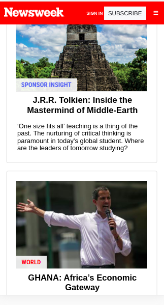
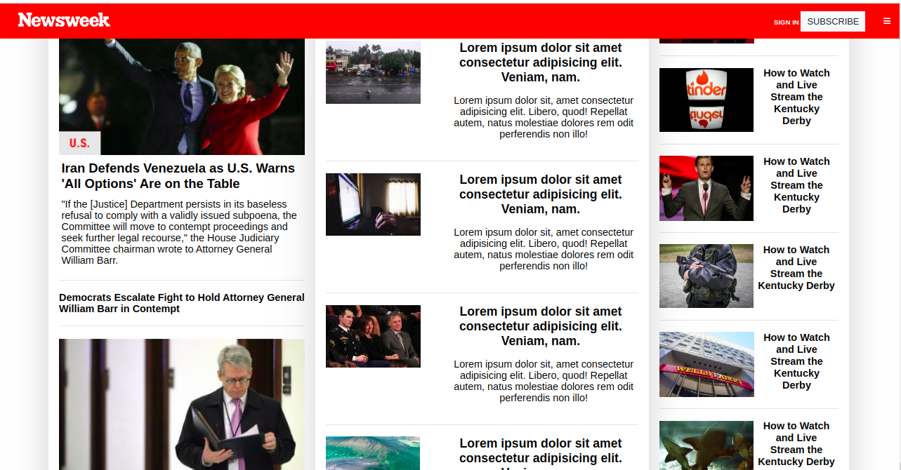

# USING BOOTSTRAP

A practical demonstration of designing a website with bootstrap framework.
This project is designed to look like [newsweek.com's news website](https://www.newsweek.com/), for the purpose of practical demonstration.
The project is part of a series of projects to be completed by students of [Microverse](https://www.microverse.org/ "The Global School for Remote Software Developers!").





## Description
 
This is a template page. It focuses on how to apply bootstrap classes to create a page.

## Technologies

- HTML
- Bootstrap

## Features

- Responsive page

## Usage

> Clone the repository to your local machine

```sh
$ git clone https://github.com/forison/Using-Bootstrap.git
```

> cd into the directory

```sh
$ cd Using-Bootstrap
```

> open index.html with your favourite web browser.

## Deployment

The demo page can be found [HERE](https://forison.github.io/Using-Bootstrap/)

## Designed and developed by

[Boakye Addo Forison](https://github.com/Forison)

## Contact

[LinkedIn](https://www.linkedin.com/in/forison/) | [Twitter](https://twitter.com/addo_forison)

## Contributing

1. Fork it (https://github.com/forison/Using-Bootstrap/fork)
2. Create your feature branch (git checkout -b feature/[choose-a-name])
3. Commit your changes (git commit -am 'What this commit will fix/add')
4. Push to the branch (git push origin feature/[chosen name])
5. Create a new Pull Request